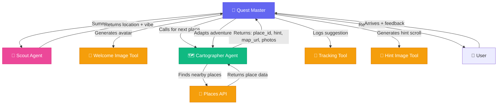

# 🎯 WanderlustAI - A Choose-Your-Adventure Trip Planner

> **Google AI Agents Hackathon — Creative and Entertainment Category**

An AI-powered urban quest system that transforms city exploration into a living, adaptive mystery where every destination is discovered through poetic hints and collaborative AI agents.

## Demo
https://github.com/user-attachments/assets/3a5fabc4-9108-4493-9663-28e8894084ba


### Presentation
https://docs.google.com/presentation/d/1tL1aTYEO7nA5zSy9qIJ9G0IH9pQPv7A_94SxRWVcWJ0/

---

## 🌆 The Experience

Imagine you've just arrived in **Rotterdam**.

You open your phone and a mysterious voice appears:

> *"Greetings, adventurer… I am the Quest Master.  
> The city hums with secrets — shall we uncover them together?"*

The AI begins by interviewing you through the **Scout** agent, learning your travel style:
- Are you drawn to whispering alleys or sunlit plazas?
- Exploring for an afternoon or an entire weekend?

Then, in the background, the **Cartographer** consults Google Maps — finding a nearby hidden gem that matches your vibe.

A poetic clue appears on your screen:

> *"Where mirrors reflect the city's soul,  
> and glass dances with the afternoon sun..."*

And beneath it — a link to **Google Maps**, but the destination name remains a mystery.

You follow the trail. When you arrive, the Quest Master reappears:

> *"Ah, you've found it! Describe what mysteries your eyes behold…"*

You share feedback, and the system adapts — changing pace, adjusting to weather, time, or even how much you've spent.

**Your trip becomes a dynamic, adaptive game** — powered entirely by AI agents working in harmony.

---

## 🧩 The Architecture

Built as a **multi-agent orchestration** using **Google's Agent Development Kit (ADK)** and deployed on **Cloud Run**.



```
google-ai-agents-hackathon/
│
├── game_master/         ← The Quest Master (main orchestrator)
│   └── agent.py
│
├── user_persona/        ← The Scout (collects travel style & vibe)
│   └── agent.py
│
├── planning/            ← The Cartographer (plans next stop)
│   └── agent.py
│
└── tools/               ← Magical utilities
    ├── hint_image.py        # Generates clue visuals
    ├── welcome_image.py     # Creates welcome avatar scrolls
    ├── places.py            # Integrates Google Maps API
    ├── tracking.py          # Logs visited places
    └── time.py              # Manages session timing
```

---

## 🎭 Agent Roles

| Agent | Role | Personality |
|-------|------|-------------|
| 🎩 **Quest Master** | The conductor of the adventure — speaks in poetic riddles, orchestrates flow between agents | Wise, mysterious, short-spoken |
| 🧭 **Scout (User Persona Agent)** | Interviews the traveler, learns vibe, preferences, trip duration | Curious, friendly, energetic |
| 🗺️ **Cartographer (Planner Agent)** | Finds real destinations via Google Maps, creates hints, filters already-visited places | Logical, precise, mystical |

Each agent uses **Agent-as-a-Tool** to call others, enabling seamless multi-agent collaboration.

---

## ⚙️ Technologies Used

| Technology | Purpose |
|------------|---------|
| **Gemini 2.5 Flash (via ADK)** | Reasoning, hint creation, conversation control |
| **ADK (Agent Development Kit)** | Multi-agent orchestration, tool calling, memory |
| **Cloud Run** | Agent deployment and scaling |
| **Google Maps API** | Real-world location search and navigation handoff |
| **Gemini Image Generation** | Creates magical "scroll" hints and avatars |
| **Vertex AI** | Session memory and user feedback loops |

---

## 🪄 How It Works

### 1. **Quest Master** greets the adventurer
> "Greetings, adventurer! I shall summon our Scout to sense your travel spirit."

### 2. **Scout** interviews the traveler
> "Are you more into hidden cafés or iconic landmarks?"

Learns:
- Location (city)
- Adventure type ("whispering alleys" vs "sun-drenched plazas")
- Trip duration

### 3. **Cartographer** finds destinations
- Calls `find_nearby_places(location, adventure_type)`
- Filters out already-suggested places from state
- Selects best remaining place with photos
- Creates poetic hint

### 4. **Tools** generate visuals
- `generate_welcome_avatar(location, adventure_type)` creates magical avatar
- `generate_hint_image(hint, avatar_filename, place_photo)` creates clue scroll
- `track_suggested_place(place_id, name)` logs visited places

### 5. **Quest Master** reveals the hint
```
"Where mirrors reflect the city's soul, 
and glass dances with the afternoon sun...

https://www.google.com/maps/search/?api=1&query=51.9086472,4.472727

**Whisper to me when you've reached this hidden realm, 
and I shall reveal what mysteries await...**"
```

### 6. User arrives and provides feedback
Quest Master adapts the adventure based on:
- Time of day
- Weather
- User feedback
- Budget
- Travel pace

---

## 🚀 Setup Instructions

### Prerequisites

- Python 3.9+
- Google Cloud Project with Vertex AI enabled
- Google Maps API key

### Installation

1. **Clone the repository**
```bash
git clone https://github.com/your-username/google-ai-agents-hackathon.git
cd google-ai-agents-hackathon
```

2. **Create a virtual environment**
```bash
python -m venv venv
source venv/bin/activate  # On Windows: venv\Scripts\activate
```

3. **Install dependencies**
```bash
pip install -r requirements.txt
cd game_master && pip install -r requirements.txt && cd ..
```

4. **Set environment variables**
```bash
# Create .env file
GOOGLE_API_KEY=your_api_key_here
GOOGLE_CLOUD_PROJECT=your_project_id
GOOGLE_CLOUD_REGION=us-central1
```

5. **Run the application**
```bash
python main.py
```

---

## 📁 Project Structure

```
google-ai-agents-hackathon/
├── main.py                    # Entry point
├── app.py                     # FastAPI application
├── requirements.txt           # Root dependencies
├── game_master/
│   ├── agent.py              # Quest Master agent
│   └── requirements.txt       # ADK dependencies
├── user_persona/
│   └── agent.py              # Scout agent
├── planning/
│   └── agent.py              # Cartographer agent
└── tools/
    ├── hint_image.py         # Hint image generation
    ├── welcome_image.py      # Avatar generation
    ├── places.py             # Google Maps integration
    ├── tracking.py           # State management
    └── time.py              # Time utilities
```

---

## 🎨 Why It's Cool

✨ **Real-world exploration becomes an evolving narrative**  
- Every trip is unique and adaptive

🎭 **Agents collaborate like characters in a story**  
- Quest Master, Scout, and Cartographer work in harmony

🧠 **Live adaptation using context**  
- Responds to weather, time, budget, and user feedback

🔗 **Seamless multi-agent orchestration**  
- Gemini, Maps, and Cloud Run work together seamlessly

🎨 **Beautiful hint imagery generated on the fly**  
- Each destination has a unique magical scroll

---

## 🌍 Future Enhancements

- 🎤 **Speech-to-text interviews** for hands-free travel
- 👯‍♀️ **Group adventures** with multi-user agent sessions
- 💰 **Budget-aware path planning** with live updates
- 📖 **Memory persistence** for ongoing travel journals
- 🗺️ **Route optimization** based on walking/driving preferences
- 🌧️ **Weather-aware recommendations** that adapt in real-time
- 📸 **Photo analysis** to understand what users enjoyed

---

## 🧭 Example Flow

```python
# Quest Master orchestrates the flow:
1. Greet → summon Scout
2. Scout interviews → returns location + vibe
3. Generate welcome avatar
4. Call Cartographer → get next destination
5. Generate hint image
6. Reveal hint to user
7. Wait for user to arrive
8. Collect feedback
9. Repeat with adapted style
```

---

## 📝 License

This project is part of the Google AI Agents Hackathon — Creative and Entertainment Category.

---

## 🤝 Acknowledgments

Built with:
- **Google Agent Development Kit (ADK)** for multi-agent orchestration
- **Gemini 2.5 Flash** for intelligent reasoning
- **Google Maps API** for real-world discovery
- **Cloud Run** for scalable deployment

---

> "Travel shouldn't be planned — it should **unfold**.  
> Our Choose-Your-Adventure Trip Planner turns the city into a living story,  
> where every step whispers a new mystery."
